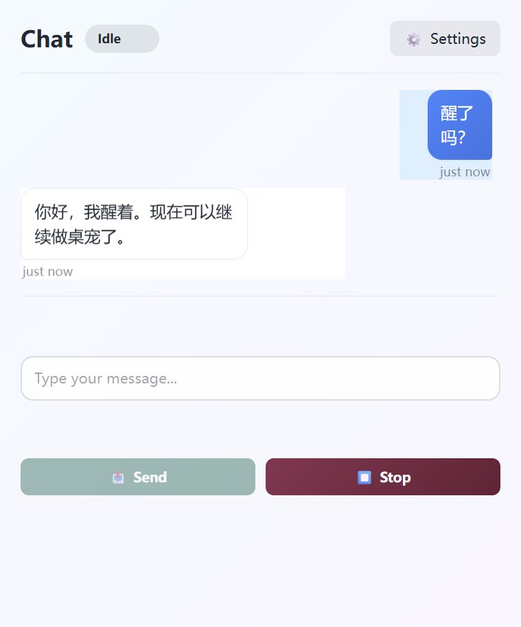

# Greyfield Next

<p align="center">
  
</p>

<p align="center">
  <strong>Anime-first Live2D desktop companion.</strong>
</p>

<p align="center">
  二次元桌宠 · Transparent pet window · Streaming chat · Interruptible replies · Recent context
</p>

Greyfield Next is a TypeScript monorepo for rebuilding Greyfield around the desktop-pet spine first. The character is the product surface: visible on the desktop, responsive to the user, and backed by harnesses so the cute part does not drift away from the working part.

## Character First

<p align="center">
  
</p>

This is not a generic chat shell with a tiny mascot bolted on. V1 starts from the visible Live2D companion, then adds chat, speech bubble, interrupt, memory, settings, and provider paths around that desktop-pet loop.

## Product Surfaces

| Desktop pet | Chat |
| --- | --- |
|  |  |

## V1 Focus

Greyfield V1 is built around one product loop:

1. Load a real `.model3.json` Live2D model in a transparent Electron pet window.
2. Let the user type to the assistant and see the reply stream back.
3. Surface short speech-bubble text on the pet while preserving full chat history in the chat window.
4. Allow interruption so stale model chunks and speech playback do not keep running.
5. Keep persona, memory, and recent session context available across turns.
6. Prove the behavior with deterministic fake providers and executable harnesses.

V1 deliberately excludes desktop control, browser control, screen reading, long-running task orchestration, multi-agent behavior, livestream support, Godot/VRM, message gateways, and self-generating skills.

## Current Shape

Completed V1 pieces include the transparent pet window, Live2D model import path, alpha hit testing, transparent-area pass-through, model drag, bounded wheel scale, persona/memory prompt assembly, desktop recent-context persistence, and the fake-provider acceptance chain.

In-progress V1 pieces include streaming runtime hardening, sentence-level TTS, interrupt state-machine completion, settings/provider testing, and speech-bubble polish. The authoritative status lives in [`packages/dev-harness/v1-features.json`](packages/dev-harness/v1-features.json).

## Quick Start

```bash
pnpm install
pnpm dev:live2d
```

`pnpm dev:live2d` starts the visible Electron desktop pet with the bundled Live2D official sample fixture. The default model is Momose Hiyori at `apps/desktop/public/assets/live2d/momose-hiyori/runtime/hiyori_free_t08.model3.json`. Set `GREYFIELD_LIVE2D_FIXTURE` to another `.model3.json` to test a different model without changing source files.

For the tight visual loop:

```bash
pnpm dev:live2d:fast
pnpm dev:live2d:stop
```

## Verification

```bash
pnpm test
pnpm test:backend
pnpm test:frontend
pnpm test:unit
pnpm typecheck
pnpm build:desktop
pnpm harness:acceptance
pnpm harness:v1-visual
pnpm harness:live2d
pnpm harness:pet:quick
pnpm harness:electron
pnpm harness:electron:quick
```

`pnpm harness:fallback` is diagnostic only. It does not count as V1 Live2D acceptance.

Use `pnpm test:backend` for runtime, persistence, audio, and Electron main regressions. Use `pnpm test:frontend` for renderer, preload, stage, and dev-harness regressions. Use `pnpm harness:v1-visual` when a change needs human-verifiable desktop-pet artifacts; it writes screenshots and `summary.json` to `.cache/greyfield-v1-visual-acceptance/latest` unless `GREYFIELD_ACCEPTANCE_ARTIFACT_DIR` is set.

CI is split into fast checks, desktop-pet quick checks, and checkpoint Electron checks. Use the narrow harness while iterating, then run the checkpoint path before claiming a V1 milestone.

## Workspace Map

```text
apps/desktop              Electron shell, windows, IPC, renderer UI
packages/stage-live2d     Pixi/Live2D stage, model import, hit testing, reactions
packages/core-runtime     Prompt assembly, streaming runtime, interrupt path
packages/audio-runtime    Sentence splitting, TTS boundary, audio-level mapping
packages/persistence      Config, character, memory, session storage
packages/dev-harness      V1 manifest, acceptance scripts, Electron harnesses
```

## Architecture

The diagram lives in [`docs/architecture-diagram.md`](docs/architecture-diagram.md). Product constraints and acceptance rules live in:

- [`docs/product-shape.md`](docs/product-shape.md)
- [`docs/desktop-pet-product-commonsense.md`](docs/desktop-pet-product-commonsense.md)
- [`docs/failure-retro.md`](docs/failure-retro.md)
- [`docs/technical-reference-projects.md`](docs/technical-reference-projects.md)
- [`packages/dev-harness/v1-features.json`](packages/dev-harness/v1-features.json)

New V1 behavior should update the feature manifest first, then add the smallest test or harness path that proves it.
