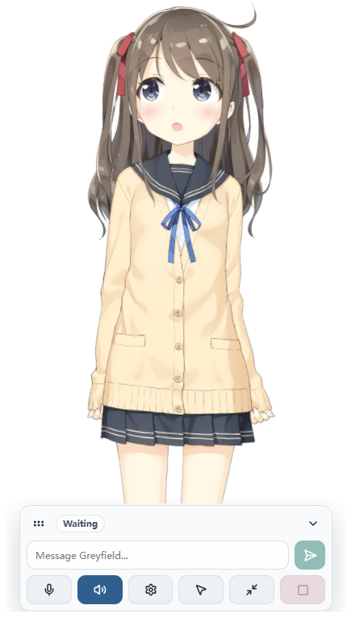
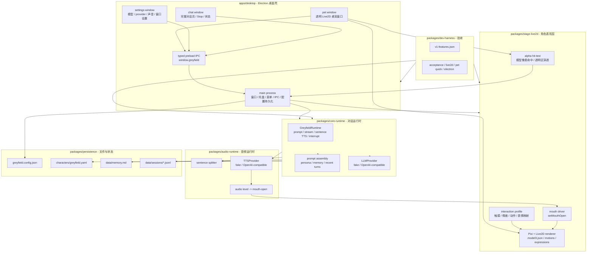

# Greyfield Next

<p align="center">
  
</p>

Greyfield Next is a fresh TypeScript monorepo for rebuilding Greyfield as a Live2D desktop companion. DigitalMate2D defines the desktop-pet UX target, AIRI informs the narrow Pixi/Live2D technical route, and the old Greyfield repository is used only as a vision note and failure retro.

## V1 Goal

Make the character feel alive first:

- visible real `.model3.json` Live2D desktop pet window
- text input to streaming assistant response
- sentence-level TTS instead of waiting for the full reply
- interrupt path that stops later model chunks and speech playback
- persona, short memory, and recent session continuity
- fake providers for deterministic development and QA
- touch, motion, expression, and mouth-open checks that must involve the real Live2D stage

V1 does not include desktop control, browser control, long-running task orchestration, multi-agent behavior, livestream support, Godot/VRM, message gateways, or self-generating skills.

Current status: V1 visible-experience closeout is on `main`. The latest V1 evidence head `b605321` includes #59, #63, and #65, and GitHub Actions run `28287921556` passed Fast checks, Desktop pet quick harness, and `frontend-full` on 2026-06-27. V2.0a memory foundation is merged; V2.0b adds user-facing memory edit, disable, delete, and export controls.

## Workspace

```text
apps/desktop
packages/audio-runtime
packages/core-runtime
packages/dev-harness
packages/persistence
packages/stage-live2d
```

## Product Roadmap

- [V1 product plan](docs/plans/v1-product-plan.md)
- [Version product book](docs/plans/version-product-book.md): V1.0, V1.1, V2.0, V2.1, V2.2, V2.3, and V3.0 product scope.

## Architecture

Standalone diagram file: [docs/architecture-diagram.md](docs/architecture-diagram.md).



## Commands

```bash
pnpm install
pnpm test
pnpm test:backend
pnpm test:frontend
pnpm test:unit
pnpm typecheck
pnpm build:desktop
pnpm harness:acceptance
pnpm harness:v1-visual
pnpm harness:live2d
pnpm harness:pet:quick
pnpm harness:electron
pnpm harness:electron:quick
pnpm harness:electron:memory-control
pnpm harness:memory-benchmark
pnpm harness:frontend-full
pnpm dev:live2d
pnpm dev:live2d:fast
pnpm dev:live2d:stop
```

`packages/dev-harness/v1-features.json` is the V1 source of truth. New work should add or update a feature item first, then add the smallest test or acceptance script that proves it.

`pnpm harness:fallback` is only a diagnostic preview check. It does not count as V1 Live2D acceptance.

`pnpm dev:live2d` starts the visible Electron desktop pet with the bundled Live2D official sample fixture. The default model is Momose Hiyori at `apps/desktop/public/assets/live2d/momose-hiyori/runtime/hiyori_free_t08.model3.json`. Set `GREYFIELD_LIVE2D_FIXTURE` to another `.model3.json` to test a different model without changing source files.

Use `pnpm dev:live2d:fast` for the tight visual loop when main/preload did not change, and `pnpm dev:live2d:stop` to stop the visible pet through the PID file instead of scanning Windows processes. Use `pnpm harness:pet:quick` for frequent pet-window interaction checks; keep full `pnpm harness:electron` for checkpoint validation.

CI is split into layers:

- fast checks: `pnpm typecheck`, `pnpm test`, `pnpm harness:acceptance`, `pnpm harness:memory-benchmark`
- desktop pet quick: one desktop build plus `pnpm harness:pet:quick`
- frontend-visible gate: `pnpm harness:frontend-full` for changes touching desktop, Live2D, audio, dev-harness, workspace config, or CI

Use `pnpm test:backend` for runtime, persistence, audio, and Electron main regressions. Use `pnpm test:frontend` for renderer, preload, stage, and dev-harness regressions. Use `pnpm harness:v1-visual` when a change needs human-verifiable desktop-pet artifacts; it writes screenshots and `summary.json` to `.cache/greyfield-v1-visual-acceptance/latest` unless `GREYFIELD_ACCEPTANCE_ARTIFACT_DIR` is set.

Use `pnpm harness:memory-benchmark` for deterministic memory summary/recall quality, and `pnpm harness:electron:memory-control` for the ordinary Settings path that edits, disables, deletes, and exports memory while keeping raw chat turns intact.

Use `pnpm harness:frontend-full` before handing off frontend-visible V1 work. It is the aggregate gate for Settings, Chat, Pet, controls, Live2D, speech bubble, Stop/audio, voice input, restart context, and optional credentialed real TTS coverage.

Before adding new V1 behavior, read [docs/failure-retro.md](docs/failure-retro.md), [docs/desktop-pet-product-commonsense.md](docs/desktop-pet-product-commonsense.md), and [docs/technical-reference-projects.md](docs/technical-reference-projects.md). The previous Greyfield failed by mixing too many systems into the first spine; Greyfield Next keeps the alive desktop companion loop separate from later control/agent modules.
