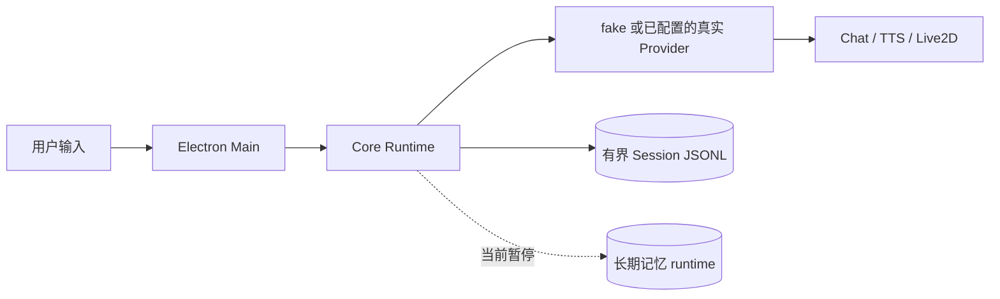

<div align="center">

# Greyfield Next


**生活在桌面上的 Live2D AI 伴侣（源码 + Windows portable 预览）**

[]()
[]()
[]()

[当前状态](#-当前状态) • [快速开始](#-快速开始) • [冻结的后续方向](#️-冻结的后续方向) • [架构设计](#️-架构设计) • [文档](#-文档)

</div>

---

## 🎯 Greyfield 是什么？

Greyfield Next 是一个 TypeScript + Electron + Pixi.js 构建的 Live2D 桌面伴侣原型。目前主线证明的是：透明桌面对象、可见且可中断的对话、语音与 Live2D 反馈，以及跨重启的有界最近对话连续性。

仓库现在能构建一个自包含的 Windows x64 portable 预览，但尚未发布 GitHub Release，也没有安装器、签名或自动更新。它也不应被描述成已经具有长期语义记忆的成品；当前桌面 runtime 明确暂停长期记忆的写入与召回。

### 核心理念

1. **桌面优先**：透明窗口、可拖动、低打扰存在
2. **用户掌控**：能力状态可见，回复和语音可停止
3. **证据驱动**：功能由测试、Electron harness 或截图证明

---

## ✨ 当前状态

### 首次打开会看到什么

- Controls 与 Chat 会显示 **“试玩模式”**，并提供 **“配置真实聊天”** 入口。
- 默认 LLM 是 fake provider，只返回确定性演示回复；这不是远程模型能力。
- 默认 ASR 是 fake provider，麦克风入口明确标为 **“固定转写试玩”**；它不会识别真实语音内容。
- 主动说话默认关闭，主动程度为 0；屏幕感知默认关闭；回复朗读默认关闭。
- Settings 会显示 **“长期记忆当前暂停”**，新的长期记忆抽取开关不可用。

### 已有的可验证能力

- 🎭 `.model3.json` Live2D 渲染、透明宠物窗口和 alpha 命中测试
- 💬 fake 试玩对话，以及可配置的 OpenAI-compatible 流式聊天路径
- ⏹️ Stop 中断 LLM、ASR/TTS、播放队列和嘴型状态
- 🎨 触摸交互、表情、动作与短气泡；完整回复保留在 Chat
- ⚙️ Settings、Chat、独立 Controls 窗口与 provider 测试
- 🎤 麦克风录音、OpenAI-compatible ASR/TTS 路由及确定性 fake harness
- 🧾 JSONL session 保存和有界 recent-message prompt continuity

### 真实聊天怎样才算就绪

1. 在 Settings 选择 OpenAI-compatible LLM。
2. 填写 Base URL、API key 和 Chat model。
3. 运行 **Test LLM**。

字段缺失时显示“配置未完成”；字段完整但尚未测试时显示“配置已保存，待测试”；测试失败时显示可读原因和“重新测试”。只有字段完整且当前连接测试成功，Controls 与 Chat 才显示“真实聊天已就绪”。修改 LLM、Base URL、API key 或 Chat model 后，旧成功状态会立即失效；重新启动后也需要再次测试当前连接。

### 当前边界

- `Launch Greyfield.vbs` / `Stop Greyfield.vbs` 是 Windows 上的**源码开发启动器**，负责启动现有 pnpm 开发流程；它不是安装包或发行版。
- Windows portable 预览未签名，首次运行可能触发 Microsoft Defender SmartScreen；没有自动更新或安装器，也尚未发布 Release。
- portable 只验收内置 Live2D 模型；用户自定义的绝对模型路径尚未作为便携交付路径验收。
- 本地 SSE stub 只证明 OpenAI-compatible HTTP/SSE 合约、真实回复展示与中断，不证明任一公网供应商当前可用。
- 重启后 Chat 只显示“已恢复最近 N 条对话消息（不是长期记忆）”。renderer 只收到有界数量，不收到历史正文。
- 第二次 provider 请求会在主进程内使用有界 recent messages；这属于短期上下文连续性，不是长期语义记忆。
- 仓库保留记忆 benchmark、数据结构与开发管理表面，不代表当前桌面 runtime 已启用长期记忆。

---

## 🧊 冻结的后续方向

以下 V2-V6 只记录产品方向，不是当前能力、交付时间或实现承诺。在首次可信体验和可下载 MVP 被证明之前，不从这些方向扩张 V1。

| 方向 | 候选价值 | 当前状态 |
|---|---|---|
| V2 长期记忆 | 可解释来源、可删除、删除后不再召回 | 冻结；desktop runtime 暂停 |
| V3 扩展能力 | 受控工具与插件 | 冻结 |
| V4 深度陪伴 | 声音人格、跨设备连续性 | 冻结 |
| V5 Agent 生态 | 工具协议与社区集成 | 冻结 |
| V6 具身化 | VR/AR、3D avatar 与空间交互 | 冻结 |

历史讨论索引见 [Issue #186](https://github.com/zuiho-kai/greyfield-next/issues/186)，不能作为当前完成状态使用。

---

## 🚀 快速开始

### 前置要求

- Node.js 18+
- pnpm
- Windows 10/11（当前主要桌面验收环境）

### 从源码启动

```bash
pnpm install
pnpm typecheck
pnpm test
pnpm dev:live2d
```

Windows 也可以双击 `Launch Greyfield.vbs` 启动同一套源码开发流程，并用 `Stop Greyfield.vbs` 停止。首次启动默认进入 fake LLM/ASR 试玩，不会自动连接真实模型。

### 构建 Windows portable 预览

```bash
pnpm install --frozen-lockfile
pnpm package:windows:portable
```

产物固定为 `.cache/greyfield-windows-portable/artifacts/Greyfield-0.1.0-preview.1-win-x64-portable.exe`。这是本地构建的未签名预览，不代表项目已经发布可下载版本。

要从仓库外复制并启动同一个 portable、验证真实用户路径、Stop、写入隔离和重启连续性，可运行：

```bash
pnpm verify:windows:portable
```

### 配置真实 provider

打开 Controls 中的“配置真实聊天”，在 Settings 完成 OpenAI-compatible LLM 配置并点击 **Test LLM**。保存字段本身不等于连接已就绪；测试结果也不会作为跨重启凭据持久化。

### 窄验证

```bash
# 单元与类型
pnpm test
pnpm typecheck

# 快速桌宠路径
pnpm harness:pet:quick

# fresh/default 视觉证据
pnpm harness:v1-visual

# 跨重启 recent-message continuity
pnpm harness:electron:restart-context
```

`pnpm harness:frontend-full` 是较慢的聚合门禁，不是小改动的默认反馈环。

---

## 🏗️ 架构设计

### 工作空间结构

```text
apps/
  desktop/              # Electron 桌面壳、窗口、IPC 与 renderer
packages/
  audio-runtime/        # TTS、ASR、句子分割、音频电平
  core-runtime/         # 对话循环、prompt 组装、provider
  dev-harness/          # 验收、Electron harness、视觉证据
  persistence/          # 配置、角色与 session 存储
  stage-live2d/         # Pixi + Live2D 渲染、命中与反应
```

### 当前数据流


```mermaid
flowchart LR
  User["用户输入"] --> Desktop["Electron Main"]
  Desktop --> Runtime["Core Runtime"]
  Runtime --> Provider["fake 或已配置的真实 Provider"]
  Provider --> Stage["Chat / TTS / Live2D"]
  Runtime --> Sessions[("有界 Session JSONL")]
  Runtime -. "当前暂停" .-> Memory[("长期记忆 runtime")]
```

[完整架构图](docs/architecture-diagram.md)

---

## 🔬 质量保证

`packages/dev-harness/v1-features.json` 是 V1 验收事实源。测试通过只证明对应路径，不把冻结能力升级成产品承诺。

当前有明确证据的门禁包括：

- Live2D 非 fallback 渲染、透明窗口、命中、拖动与气泡位置
- Controls/Chat/Settings fresh/default 截图与首眼入口
- provider 缺配置、待测试、失败、成功和改配置后失效
- fake ASR 固定转写披露，以及真实 ASR/TTS 请求路径
- Stop 的文本、网络、语音、播放队列和嘴型中断
- restart harness 的可见最近消息数量与第二次请求上下文
- Windows portable 的仓库外启动、`file:` renderer、内置 Live2D 非 fallback、真实回复、Stop、userData 隔离与同一 exe 重启
- 长期记忆暂停文案和 renderer 不接收历史正文的类型/单元约束

记忆 benchmark 评估仓库中的算法与数据结构，不证明当前 desktop runtime 已启用长期记忆。

---

## 🛠️ 命令参考

### 测试

```bash
pnpm test
pnpm test:backend
pnpm test:frontend
pnpm test:unit
pnpm typecheck
```

### 开发

```bash
pnpm dev:live2d
pnpm dev:live2d:fast
pnpm dev:live2d:stop
pnpm launch:windows
```

### 验收

```bash
pnpm harness:acceptance
pnpm harness:v1-visual
pnpm harness:live2d
pnpm harness:pet:quick
pnpm harness:electron
pnpm harness:electron:quick
pnpm harness:electron:restart-context
pnpm harness:windows:portable
pnpm harness:memory-benchmark
```

### 构建

```bash
pnpm build:desktop
pnpm package:windows:portable
pnpm verify:windows:portable
```

---

## 🎮 配置

### Live2D 模型

设置 `GREYFIELD_LIVE2D_FIXTURE` 可以在开发/验收时指定 `.model3.json`：

```bash
export GREYFIELD_LIVE2D_FIXTURE=/path/to/your/model.model3.json
pnpm dev:live2d
```

默认模型位于 `apps/desktop/public/assets/live2d/momose-hiyori/`。

### Providers

Settings 支持 fake 试玩 provider 与 OpenAI-compatible 路径。fake LLM/ASR 仅用于离线演示和 harness；真实 LLM 必须配置并 Test，真实 ASR/TTS 也需要相应模型与连接信息。

---

## 📚 文档

### 面向用户与产品

- [V1 产品计划](docs/plans/v1-product-plan.md)
- [版本产品手册](docs/plans/version-product-book.md)
- [桌面宠物 UX 原则](docs/desktop-pet-product-commonsense.md)

### 面向开发者与贡献者

- [架构概览](docs/architecture.md)
- [开发速度策略](docs/development-speed-policy.md)
- [QA 复盘](docs/qa-retro.md)
- [失败复盘](docs/failure-retro.md)
- [进度日志](docs/progress.md)

---

## 🤝 贡献

1. 功能分支通过 PR 合并，不直接推送 `main`。
2. 新行为先映射到 `v1-features.json`，再提供最小可执行证据。
3. 可见 UI 改动需要聚焦的 Electron/视觉 artifact。
4. 不用 roadmap、benchmark 或开发管理代码代替当前产品能力证据。

---

<div align="center">

**先让第一次见面可信，再扩张能力。**

[报告 Bug](https://github.com/zuiho-kai/greyfield-next/issues) • [请求功能](https://github.com/zuiho-kai/greyfield-next/issues)

</div>
