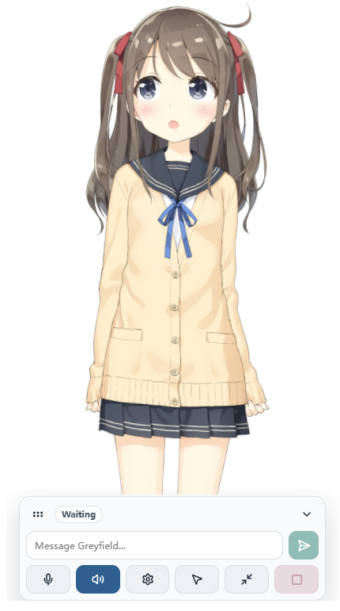
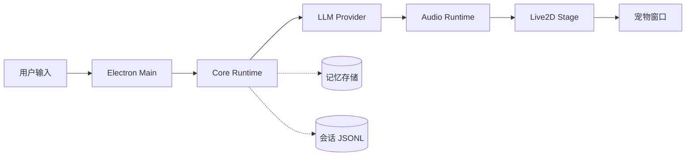

<div align="center">

# Greyfield Next



**生活在你桌面上的 AI 伴侣**

[]()
[]()
[]()

[功能特性](#-当前状态) • [产品路线图](#️-产品路线图) • [快速开始](#-快速开始) • [架构设计](#️-架构设计) • [文档](#-文档)

</div>

---

## 🎯 Greyfield 是什么？

Greyfield Next 是一个**具有长期记忆的 Live2D 桌面伴侣** —— 不只是聊天壳，而是一个能记住你的生活、理解你的情绪、和你一起成长的 AI。

基于 TypeScript + Electron + Pixi.js 构建，由 OpenAI 兼容的 LLM/TTS/ASR 驱动。

### 核心理念

1. **桌面优先**：透明窗口、可拖动、低打扰存在
2. **用户掌控**：每个能力都可以禁用、检查、删除和测试
3. **证据驱动**：每个版本都必须有验收标准和自动化覆盖

---

## ✨ 当前状态

<details>
<summary><b>V1.0：活着的桌宠</b> ✅ (基础完成)</summary>

- 🎭 真实 Live2D 渲染，透明窗口和 alpha 命中测试
- 💬 流式对话，句级 TTS
- 🎤 语音输入/输出，麦克风和自然语音
- ⏹️ 中断控制，停止 LLM/TTS/嘴型动画
- 🎨 触摸交互，表情和动作
- ⚙️ Settings/Chat 窗口，provider 测试
- 🪟 Windows 启动器，双击启动
</details>

### V2.1：长期记忆 ✅ (最小闭环已完成)
- 📝 **记忆压缩**：带来源链接的 summary
- 🧠 **结构化记忆原子**：事实、偏好、日期、承诺、关系仪式
- 🔍 **记忆库管理**：编辑/禁用/删除/导出控制
- 💭 **主动召回**：低打扰的桌面气泡
- 📊 **质量基准**：`atomRecall: 0.99`，`productReadiness: 0.58`

### V2.3：交互模型 🚧 (进行中)
- 📸 **屏幕感知**：vision model 路由
- 🎯 **任务模型槽位**：专门推理
- 🖼️ **用户触发截图**：视觉上下文

### V2.4-V2.5：声音与桌面控制 🔜 (下一步)
- 🎙️ **声音人格**：可定制的声音个性和情绪控制
- 🖥️ **受控桌面操作**：文件搜索、应用启动、提醒设置（需用户授权）

### V3.0：可扩展平台 📋 (已规划)
- 🔌 **插件系统**：社区可以扩展能力
- 🛠️ **工具市场**：浏览、安装和管理扩展

### V4.0：深度陪伴 🌟 (路线图)
- 📱 **移动端伴侣**：iOS/Android，记忆同步
- 💭 **情感连续性**：理解你的生活节奏和情绪周期
- ☁️ **跨平台同步**：设备间无缝对话

### V5.0：AI Agent 工具生态 🤖 (路线图)
- 🔧 **工具协议**：agent 能力的标准接口
- 🧠 **自我改进循环**：从反馈中学习，生成修复
- 🌐 **社区工具**：VSCode、Notion、智能家居集成

### V6.0：具身化存在 🌌 (愿景)
- 🎮 **VRChat 集成**：作为虚拟世界中的 avatar 存在
- 🥽 **Apple Vision / Meta Quest**：真实空间中的 AR 模式
- 🕺 **动作生成**：自然的 3D 移动和手势
- 🌍 **世界模型**：理解空间上下文和物理规则

📋 **[详细 V2-V6 路线图 →](https://github.com/zuiho-kai/greyfield-next/issues/186)**

---

## 🗺️ 产品路线图

| 版本 | 核心价值 | 用户体验 |
|------|---------|---------|
| V1-V2 | 活着的桌宠 + 记忆 | 能聊、能记、能想起 |
| V3 | 可扩展平台 | 能学会新技能 |
| **V4** | **深度陪伴** | **随时随地、懂我生活** |
| **V5** | **AI Agent 生态** | **能帮我做事、能自我改进** |
| **V6** | **具身化存在** | **在 3D 空间里陪着我** |

📋 **[详细 V2-V6 路线图 →](https://github.com/zuiho-kai/greyfield-next/issues/186)**

---

## 🚀 快速开始

### 前置要求
- Node.js 18+ 和 pnpm
- Windows 10/11（计划支持 macOS/Linux）

### 开发环境

```bash
# 安装依赖
pnpm install

# 运行类型检查和测试
pnpm typecheck
pnpm test

# 启动桌面宠物（开发模式）
pnpm dev:live2d

# 或者双击 Launch Greyfield.vbs（仅 Windows）
```

### 测试与验证

```bash
# 快速检查（单元测试 + 验收 + 记忆基准）
pnpm test && pnpm harness:acceptance

# 桌面宠物快速 harness
pnpm harness:pet:quick

# 完整前端验证（19 项检查，约 6 分钟）
pnpm harness:frontend-full

# 生成视觉证据（截图 + 摘要）
pnpm harness:v1-visual
```

### CI 层级
- **快速检查**：类型检查 + 单元测试 + 验收 + 记忆基准
- **桌面宠物快速**：一次构建 + 宠物窗口交互测试
- **前端可见门禁**：UI/Live2D/音频更改的完整 harness

---

## 🏗️ 架构设计

### 工作空间结构

```
apps/
  desktop/              # Electron 桌面壳
packages/
  audio-runtime/        # TTS, ASR, 句子分割, 音频电平
  core-runtime/         # 对话循环, prompt 组装, LLM provider
  dev-harness/          # 验收测试, 基准测试, 视觉证据
  persistence/          # 配置, 角色, 记忆, 会话存储
  stage-live2d/         # Pixi + Live2D 渲染器, 命中测试, 反应
```

### 数据流


```mermaid
flowchart LR
  User[用户输入] --> Desktop[Electron Main]
  Desktop --> Runtime[Core Runtime]
  Runtime --> LLM[LLM Provider]
  LLM --> TTS[Audio Runtime]
  TTS --> Stage[Live2D Stage]
  Stage --> Pet[宠物窗口]
  
  Runtime -.-> Memory[(记忆存储)]
  Runtime -.-> Sessions[(会话 JSONL)]
```

**[完整架构图 →](docs/architecture-diagram.md)**

---

## 📚 文档

### 面向用户
- [V1 产品计划](docs/plans/v1-product-plan.md)
- [版本产品手册](docs/plans/version-product-book.md)（V1-V3 详细）
- [桌面宠物 UX 原则](docs/desktop-pet-product-commonsense.md)

### 面向开发者
- [架构概览](docs/architecture.md)
- [技术参考项目](docs/technical-reference-projects.md)
- [开发速度策略](docs/development-speed-policy.md)
- [失败复盘](docs/failure-retro.md)（为什么旧 Greyfield 失败了）

### 面向贡献者
- [QA 复盘](docs/qa-retro.md)
- [进度日志](docs/progress.md)

---

## 🔬 质量保证

### 验证理念
每个 V1 功能都由 `packages/dev-harness/v1-features.json` 覆盖，并有自动化验收测试。记忆质量通过锁定基准进行基准测试。

### 当前覆盖
- ✅ 单元测试：38 个文件 / 113 个测试
- ✅ Live2D 渲染：`usedFallback=false`，帧变化，表情
- ✅ 宠物窗口：Alpha 命中测试，拖动，缩放，语音气泡
- ✅ 语音 I/O：麦克风录音，ASR 转录，TTS 播放，嘴型同步
- ✅ 记忆：Summary 压缩，atom 抽取，召回质量（`atomRecall: 0.99`）
- ✅ Electron 集成：Settings，Chat，控制条，重启上下文

### 基准测试结果（V2.1）
```
summaryRegressionScore: 1.00
recallRegressionScore:  1.00
atomExtractionScore:    0.95
atomRecallScore:        0.99
atomWritebackScore:     1.00
proactiveTriggerScore:  1.00
productReadinessScore:  0.58  ← 产品 UX 仍需改进
```

---

## 🛠️ 命令参考

### 测试
```bash
pnpm test                          # 所有测试
pnpm test:backend                  # Runtime, persistence, audio 测试
pnpm test:frontend                 # Renderer, stage, harness 测试
pnpm test:unit                     # 仅单元测试
pnpm typecheck                     # TypeScript 类型检查
```

### 开发
```bash
pnpm dev:live2d                    # 启动桌面宠物（完整构建）
pnpm dev:live2d:fast              # 快速重建（main/preload 未更改）
pnpm dev:live2d:stop              # 通过 PID 文件停止
pnpm launch:windows               # 重新生成 VBScript 启动器
```

### 验证
```bash
pnpm harness:acceptance           # 基础验收测试
pnpm harness:v1-visual            # 视觉证据（截图）
pnpm harness:live2d               # Live2D 渲染器测试
pnpm harness:pet:quick            # 宠物窗口快速检查（6-8秒）
pnpm harness:electron             # 完整 Electron 集成
pnpm harness:electron:quick       # 快速 Electron 检查（7-8秒）
pnpm harness:memory-benchmark     # 记忆质量基准
pnpm harness:frontend-full        # 完整前端门禁（19 项检查，6 分钟）
```

### 构建
```bash
pnpm build:desktop                # 构建 Electron 应用
```

---

## 🎮 配置

### Live2D 模型
设置 `GREYFIELD_LIVE2D_FIXTURE` 使用自定义 `.model3.json`：
```bash
export GREYFIELD_LIVE2D_FIXTURE=/path/to/your/model.model3.json
pnpm dev:live2d
```

默认模型：Momose Hiyori（`apps/desktop/public/assets/live2d/momose-hiyori/`）

### Providers
在 Settings 窗口或 `greyfield.config.json` 中配置 LLM/TTS/ASR：
- Fake providers（确定性，无需 API key）
- OpenAI 兼容端点（Claude, OpenAI, 本地模型）

---

## 🤝 贡献

### 开发工作流
1. 功能分支通过 PR 合并
2. CI 必须通过：快速检查 → 桌面宠物快速 → 前端完整（如果 UI 改变）
3. 不直接推送到 `main`

### 质量标准
- 新行为必须首先更新 `v1-features.json`
- 添加证明其工作的最小测试
- 视觉更改需要 `pnpm harness:v1-visual` 证据
- 记忆更改必须通过 `pnpm harness:memory-benchmark`

开源组件将逐步发布：
- V4：声音训练工具，移动端同步协议
- V5：工具协议，SDK，官方工具
- V6：渲染器接口，VRM 加载器，VR/AR 集成层

---

## 🙏 致谢

- **技术参考**：AIRI（Live2D 路线），DigitalMate2D（UX 目标），MaiBot（记忆循环）
- **框架**：Electron, Pixi.js, pixi-live2d-display, Vue
- **AI 技术栈**：Claude API（Anthropic），OpenAI 兼容 providers

---

<div align="center">

**用 ❤️ 构建，创造有意义的 AI 陪伴**

[报告 Bug](https://github.com/zuiho-kai/greyfield-next/issues) • [请求功能](https://github.com/zuiho-kai/greyfield-next/issues) • [查看路线图](https://github.com/zuiho-kai/greyfield-next/issues/186)

</div>
