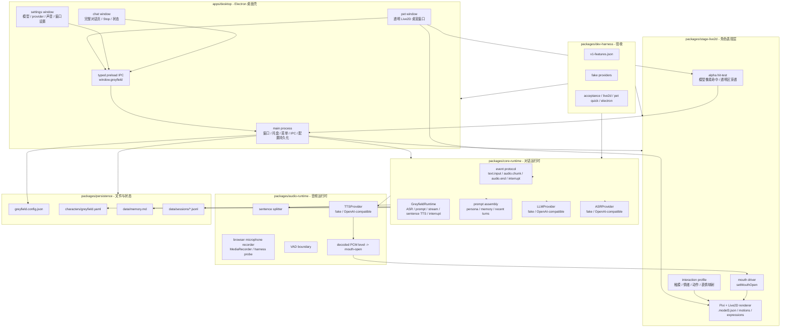

# Greyfield Next V1 架构图

这张图描述的是当前 V1 收敛后的目标架构：真实 provider 调用收口到 Electron main，renderer 只做 UI 和 stage 表现，Live2D、runtime、audio、persistence、harness 各自守住边界。

## 边界规则

- renderer 不跑真实 provider。pet/settings/chat 只发 IPC 和渲染 UI。
- Electron main 拥有真实调用权。LLM/API key/session/memory 都应该在 main 或 package 边界后面。
- Live2D stage 只管角色表现：模型加载、动作、表情、alpha 命中、口型。
- runtime 只管对话闭环：prompt、流式 LLM、句子级 TTS、interrupt、上下文。
- fake provider 是验收路径，不是最终体验。
