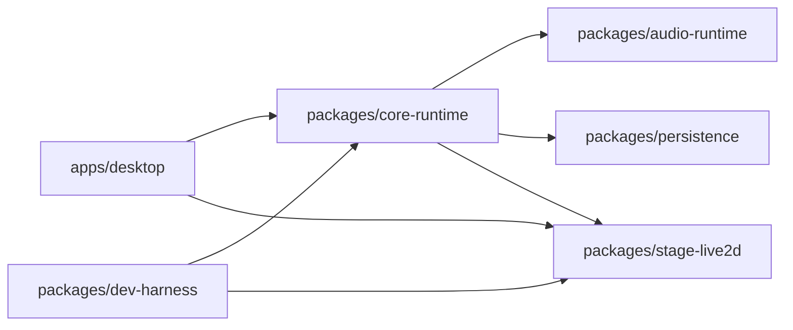

# Architecture

Greyfield Next uses an AIRI-style monorepo split with Hermes-inspired runtime boundaries, without depending on Hermes in V1.

## Package Boundaries

- `apps/desktop`: Electron/Vite/Vue shell, transparent pet window, settings shell, tray, logs, typed IPC.
- `packages/stage-live2d`: Pixi/Live2D loading, `.model3.json` resolution, expression/motion/touch/mouth driver.
- `packages/core-runtime`: event protocol, prompt assembly, provider abstraction, persona and session loop.
- `packages/audio-runtime`: sentence splitting, playback queue, future VAD/ASR/TTS adapters.
- `packages/persistence`: config, character files, memory Markdown, session JSONL.
- `packages/dev-harness`: V1 feature manifest, fake provider acceptance, future Playwright Electron checks.

## Runtime Ownership Rules

The Electron main process owns real runtime execution in desktop builds:

- Renderer sends `runtime:input` and applies `runtime:event` to UI state.
- Renderer may run a fake preview only when no preload host exists, such as unit tests or plain browser preview.
- Renderer must not construct real LLM, ASR, TTS, memory, or session providers.
- Main process redacts settings before broadcasting them to renderer windows. Renderer receives only `RendererGreyfieldConfig`, where `provider.apiKey` is either empty or masked.
- New `text.input` interrupts the currently active main-process runtime before starting the next one. Multiple active provider streams are not allowed in the V1 desktop path.

This is a hard guardrail from the old Greyfield failure: modules are not enough if renderer, main, and runtime can all independently decide how to talk to providers.

## Event Protocol

Inputs:

- `text.input`
- `audio.chunk`
- `audio.end`
- `runtime.interrupt`
- `stage.touch`
- `settings.update`

Outputs:

- `runtime.status`
- `transcript.partial`
- `transcript.final`
- `assistant.text.delta`
- `assistant.text.final`
- `assistant.audio.chunk`
- `assistant.audio.end`
- `stage.expression`
- `stage.motion`
- `error`

## V1 Runtime Loop

1. Load memory and recent session context.
2. Assemble prompt from persona, boundaries, handoff, memory, and recent turns.
3. Stream LLM deltas.
4. Split complete sentences for TTS.
5. Emit audio chunks and stage mouth-open events.
6. Stop cleanly on `runtime.interrupt`.
7. Append user and assistant turns to the session store.
